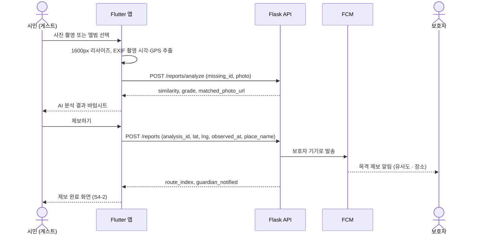
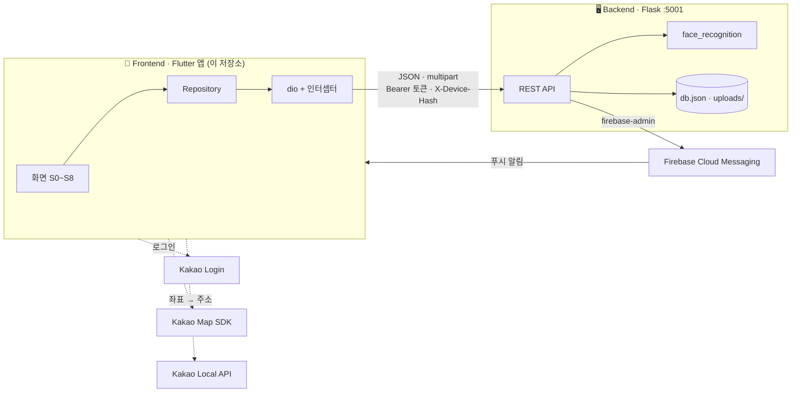
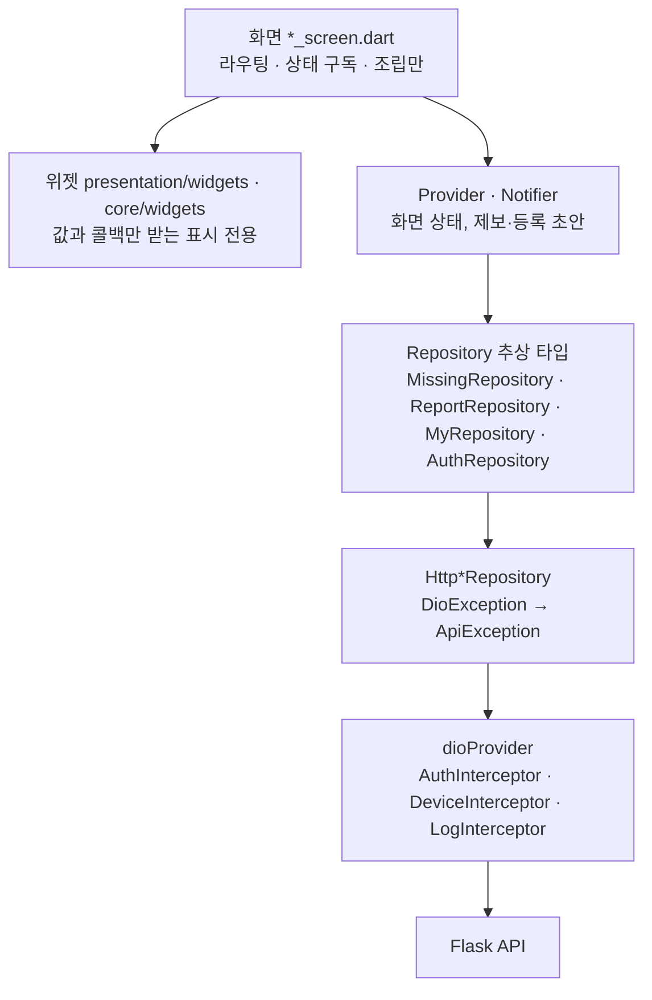

<div align="center">

# 곁愛 · 곁애 (Gyeot-ae) — Frontend

**시민의 목격 사진 한 장을 AI가 검증하고, 검증된 제보를 시간순으로 이어<br/>실종 아동·어르신의 이동 경로를 지도 위에 복원하는 조기 발견 앱**

"곁에 있다 + 사랑" — 지나가던 시민의 눈이 모여 실종자의 골든타임을 지킵니다.

📱 **Frontend · Flutter 앱 (현재 저장소)** · 🖥️ [Backend · Flask API 서버](https://github.com/Starton2026/Gyeot-ae-Backend)

</div>

---

## 1. 서비스 소개

| | |
|---|---|
| **서비스명** | 곁애 (Gyeot-ae) |
| **한 줄 소개** | 시민 제보 → AI 얼굴 유사도 분석 → **시간순 이동 경로 복원** → 보호자에게 즉시 알림 |
| **해결하려는 문제** | 실종 경보는 시민에게 **전달만 되고 돌아오지 않는다.** 목격해도 알릴 창구가 마땅치 않고, 들어온 제보도 진위와 순서를 가리기 어렵다 |
| **핵심 가치** | 시민의 목격이 **보호자에게 되돌아오는 양방향 구조**. 흩어진 제보를 AI가 거르고, 하나의 동선으로 이어 "지금 어디쯤 있을지"를 보여준다 |

```
보호자 등록 → 주변 시민 알림 → 시민 제보(사진) → AI 유사도 분석
→ 검증된 제보를 시간순 연결 → 이동 경로 복원 → 보호자 확인 → 발견
```

이 저장소는 곁애의 **모바일 앱**입니다. 시민이 제보하고, 보호자가 등록·확인하고, 모두가 지도에서 경로를 보는 **모든 사용자 경험**을 담당합니다. AI 분석·경로 계산·푸시 발송은 [백엔드](https://github.com/Starton2026/Gyeot-ae-Backend)가 맡습니다.

---

## 2. Problem

| 기존 방식의 문제 | 결과 |
|---|---|
| 📢 **일방향 경보** — 재난문자·앰버 경보는 알리고 끝난다 | 시민이 봤더라도 그 목격이 보호자에게 닿는 경로가 없다 |
| 🧾 **제보의 문턱** — 우연히 지나가던 목격자에게 가입·신고 절차는 너무 길다 | 목격한 순간이 지나면 제보는 사라진다 |
| 🧩 **흩어진 제보** — 사진·위치·시간이 따로 논다 | 여러 제보가 모여도 "어느 방향으로 움직였는지" 알 수 없다 |
| ⏱️ **골든타임** — 곁애는 실종 후 **3시간**을 골든타임으로 보고 긴급도를 가장 높게 매긴다 | 늦은 제보, 가짜 제보를 거르는 시간이 곧 수색 시간을 잡아먹는다 |

---

## 3. Solution

곁애는 **"누구나 가입 없이 제보하고, AI가 순서를 매기고, 지도가 잇는다"** 는 흐름으로 문제를 풉니다.

1. **보호자**가 카카오 로그인 후 실종자 사진(최대 5장)·인상착의·마지막 목격 위치를 등록합니다.
2. 서버가 **반경 안의 시민 기기**에 푸시 알림을 보냅니다.
3. **시민**은 로그인 없이 사진을 찍거나 고릅니다. 앱이 사진의 **EXIF에서 촬영 시각·위치**를 읽어 채웁니다.
4. **AI가 먼저 분석**해 등록 사진과의 유사도를 보여주고, 시민은 결과를 확인한 뒤 제보를 확정합니다.
5. 서버가 유사도 40% 이상 제보를 **목격 시각 순으로 경로**로 잇고, **보호자에게 즉시 푸시**를 보냅니다.
6. 보호자와 시민은 지도에서 **시간 슬라이더를 끌며 경로가 자라나는 모습**을 봅니다.
7. 보호자가 **발견 완료**를 누르면, 제보해 준 시민들에게 "찾았습니다" 알림이 돌아갑니다.

### 화면 구성

하단 4탭 `홈` · `실종자` · `지도` · `MY` 와 모달 화면으로 구성됩니다.

| ID | 화면 | 로그인 | 핵심 요소 |
|---|---|:---:|---|
| S0 | 스플래시 · 온보딩 | — | 서비스 원리 일러스트, 권한 안내 |
| S1 | 홈 | 불필요 | 골든타임 안 1위 사건 **긴급 배너**, 주변 진행 중 사건, 읽기 전용 지도 |
| S2 | 실종자 목록 | 불필요 | 검색 · 구분 필터 · 긴급도/최신/거리순, 발견 완료는 맨 아래에 흐리게 |
| S3 | 실종자 상세 | 불필요 | 사진 캐러셀, 인상착의, 경로 미리보기 지도, **제보 타임라인** |
| S4 | 제보창 | 불필요 | 사진 · 자동 채움 위치/시각 · 장소 이름 |
| S4-1 | AI 분석 결과 (바텀시트) | 불필요 | **유사도 게이지 + 가장 닮은 등록 사진 비교** |
| S4-2 | 제보 완료 | 불필요 | 제보 요약, 지도에서 경로 보기 |
| S5 | 지도 | 불필요 | 전체 사건 보기 · 사건 선택 시 **경로 + 시간 슬라이더** |
| S6 | 로그인 (모달) | — | 카카오 로그인 |
| S7 | 실종자 등록 | **필요** | 사진 다중 선택 · 지도에서 위치 고르기 · 임시 저장 |
| S8 | MY | 분기 | 내가 등록한 실종자 · 발견 완료 처리 · 내 제보 이력 |

---

## 4. 주요 기능

### ① AI 분석 결과를 보고 결정하는 제보

| | |
|---|---|
| **해결하는 문제** | 시민이 "내가 본 사람이 맞나"를 **제보 전에** 확인할 수 있어야 한다. 결과를 보고 아니면 취소할 수 있어야 한다 |
| **사용 방법** | 제보창에서 사진 선택 → **사진 분석하기** → 바텀시트에서 유사도 게이지와 **가장 닮은 등록 사진**을 나란히 비교 → 제보하기 또는 닫기 |
| **앱 구현** | `ReportDraftNotifier`가 `POST /reports/analyze`(분석만) → `POST /reports`(확정)를 **두 단계로 호출**. 분석 결과는 10분 뒤 만료되며, 만료 응답(`ANALYSIS_EXPIRED`)은 메시지 문자열이 아니라 **오류 코드로 분기**해 재분석을 안내. 유사도는 **숫자·색·등급 글자 세 가지로** 표시해 색만으로 판단하지 않게 했다 (`SimilarityArcGauge`) |
| **서버 역할** | 등록 사진 여러 장의 얼굴 벡터와 비교해 최고 유사도·등급(`high` 70%↑ / `medium` 40~70% / `low` / `no_face`)을 계산 |

### ② 이동 경로 복원 지도 + 시간 슬라이더

| | |
|---|---|
| **해결하는 문제** | 점으로 흩어진 제보를 **하나의 동선**으로 봐야 수색 방향을 정할 수 있다 |
| **사용 방법** | 지도 탭 → 검색·필터로 사건을 고르면 실종 지점부터 **번호 핀이 폴리라인으로** 이어진다. **슬라이더를 끌면 그 시각까지의 경로만** 남고, "60% 이상만" 토글로 신뢰도 높은 제보만 볼 수 있다. 핀을 누르면 제보 사진·유사도가 시트로 열린다 |
| **앱 구현** | `kakao_map_sdk`(네이티브 카카오맵) 위에 핀·경로를 올린다. `MapCaseView`가 **하나의 필터 결과에서 핀 목록과 경로 목록을 함께 파생**해 슬라이더·토글 조작 중에도 둘이 어긋나지 않는다. 지도에 무엇을 그릴지는 `MapPlan`(sealed `MapMark`)으로 기술해 지도 탭·홈·상세가 같은 그리기 규칙을 공유한다 |
| **서버 역할** | 제보가 들어올 때마다 `route_index`를 목격 시각 순으로 다시 매기고, 타임라인·경로·슬라이더 눈금(`time_range.ticks`)을 한 번에 응답 |

### ③ 로그인 없는 제보 (설계 목표: 촬영부터 전송까지 30초)

| | |
|---|---|
| **해결하는 문제** | 목격자 대부분은 우연히 지나가는 사람이다. **가입 절차와 빈 입력란은 제보 자체를 없앤다** |
| **사용 방법** | 사건 상세 → **제보하기** → 사진(촬영/앨범) → 위치·시각이 **이미 채워져 있음** → 필요하면 "만수주공 앞 버스정류장" 같은 장소 이름만 덧붙이기 → 분석 → 제보 |
| **앱 구현** | `DeviceInterceptor`가 모든 요청에 **`X-Device-Hash`** 를 붙여 게스트를 식별 (나중에 로그인하면 같은 기기의 제보가 계정으로 귀속). `exif`로 `DateTimeOriginal`·GPS를 읽어 **앨범 사진에 현재 위치가 잘못 붙는 것을 막고**, 값의 출처를 화면에 적어 틀렸을 때만 고치게 했다. 사진은 **장변 1600px로 줄여** 업로드. **위치 권한을 거부해도 제보는 된다** (좌표 없는 제보는 경로에서만 빠짐). 작성 중 나가려 하면 되묻는다 |

### ④ 푸시 알림 — 목격이 보호자에게 되돌아오는 고리

| 알림 | 받는 사람 | 누르면 |
|---|---|---|
| 🆕 새 실종 신고 | 반경 안 시민 (기본 5km, 등록자 본인 제외) | 사건 상세 |
| 👀 목격 제보 도착 | 그 사건의 보호자 (반경·방해 금지 시간 무시) | 사건 상세 |
| 🎉 발견 완료 | 그 사건에 제보한 시민 (게스트 포함) | 사건 상세 |

- **앱 구현**: `firebase_messaging`으로 FCM 토큰을 받아 `DeviceRegistrar`가 기기 해시·현재 좌표와 함께 `POST /devices`에 등록 (로그인 불필요, 토큰 갱신 시 재등록). 안드로이드는 앱이 전면에 있을 때 시스템 알림을 그리지 않아 **앱 안에 알림 바(`PushAlertBar`)를 직접 띄운다.** 알림 `data.type`으로 이동할 화면을 정하고, **모르는 알림 종류면 화면을 열지 않는다.**
- Firebase 초기화에 실패해도 `SilentPushMessaging`으로 대체돼 **앱은 알림 없이 정상 실행**된다.

### ⑤ 보호자 경험 — 등록부터 발견 완료까지

| | |
|---|---|
| **해결하는 문제** | 실종 직후의 보호자는 경황이 없다. 긴 폼에서 실수하거나 중간에 나가도 입력이 사라지면 안 된다 |
| **사용 방법** | 홈 또는 실종자 탭에서 **실종자 등록** → 앨범에서 사진 여러 장 한 번에 선택 → **지도 가운데 핀을 옮겨** 마지막 위치 지정(주소 자동 표시) → 등록하면 새 사건 상세로 이동. MY에서 내 사건을 **발견 완료**로 바꾸면 홈·목록·지도에 바로 반영 |
| **앱 구현** | `RegisterDraftNotifier`가 입력을 **기기에 임시 저장**(`shared_preferences`)해 이어 쓰기 가능. 좌표 → 주소는 **카카오 로컬 API(`coord2address`)**. 서버 오류 응답의 `field`를 폼 항목에 매핑해 **해당 칸 아래에 오류를 표시**하고, 얼굴 미검출(`FACE_NOT_FOUND`)은 사진 칸으로 안내. 긴급도 정렬·경과 시간은 서버 값을 그대로 쓴다 (사용자가 리셋·조작 불가) |

---

## 5. 차별점

### 기존 서비스·방식과 무엇이 다른가?

| | 기존 실종 경보 / 제보 게시판 | **곁애** |
|---|---|---|
| 정보 흐름 | 일방향 전달 | **시민 → 보호자로 되돌아오는 양방향** (제보 즉시 푸시, 발견 시 제보자에게 결과 알림) |
| 제보 문턱 | 가입·전화·양식 | **로그인 없이 사진 한 장**, 시각·위치는 EXIF에서 자동 |
| 제보 검증 | 사람이 하나하나 확인 | **AI 유사도 등급**으로 우선순위 제시, 최종 판단은 사람 |
| 결과물 | 제보 목록 | **시간순 이동 경로 + 시간 슬라이더** |
| 노출 순서 | 최신순 또는 수동 재등록 | **긴급도 알고리즘** 자동 정렬 (골든타임 × 취약도 × 거리 × 제보공백) |

### AI가 만드는 가치 — "걸러내기"가 아니라 "순서 매기기"

- **40% 미만 제보도 저장합니다.** 옷을 갈아입었거나 뒷모습만 찍힌 진짜 제보가 있고, **고령자는 얼굴 인식 정확도가 구조적으로 낮기** 때문입니다. 임계값은 삭제 기준이 아니라 **표시 등급과 경로 포함 여부**만 정합니다.
- **얼굴이 안 보여도 제보는 유효합니다.** 위치와 시간만으로 타임라인에 남습니다.
- 분석 결과에 **어느 등록 사진과 가장 닮았는지**를 함께 보여줘, AI 숫자를 **사람이 눈으로 검증**할 수 있습니다.

### 앱 경험 설계 원칙

| 원칙 | 적용 |
|---|---|
| **입력란 하나가 제보 하나를 지운다** | 위치·시각은 자동으로 채우고 틀렸을 때만 고치게, 장소 이름은 원하는 사람만 시트에서 |
| **권한 거부는 정상 경로** | 위치 거부 → 위치 없이 제보, 카카오 키 없음 → 지도·로그인만 비활성 |
| **로그인은 선택** | 로그인 강제 리다이렉트 없음, 401을 받아도 토큰만 정리 |
| **긴급 화면에 마스코트를 두지 않는다** | 마스코트 이음이는 제보 완료·빈 상태·온보딩에만. 경과 시간 옆에서 웃는 얼굴은 보호자에게 상처가 된다 |
| **발견 완료를 지우지 않는다** | 목록 맨 아래에 흐리게 남겨, 서비스가 실제로 작동한 기록을 보여준다 |

### 가장 인상적인 부분

> 🗺️ **시간 슬라이더를 끌면, 실종 지점에서부터 경로가 한 칸씩 자라납니다.**
> 사진첩에서 뒤늦게 올라온 과거 목격도 **촬영 시각 기준으로 제자리에 끼워집니다.**
> "시민 제보 → AI 분석 → 이동 경로 복원"이 한 화면에서 눈으로 증명되는 순간입니다.

---

## 6. 서비스 이용 흐름

```text
[보호자] MY → 카카오 로그인 → 실종자 등록 (S7)
   ↓  앱 ─ multipart ─▶ POST /missing
   ↓  서버: 얼굴 벡터 추출 → 저장 → 반경 내 기기에 FCM 발송
[시민] 푸시 수신 → 사건 상세 (S3) → 제보하기 (S4)
   ↓  앱: 사진 1600px 리사이즈 + EXIF 촬영 시각·GPS 추출
   ↓  앱 ─ multipart ─▶ POST /reports/analyze
   ↓  서버: 등록 벡터들과 비교 → 유사도·등급 (임시 저장 10분)
[시민] AI 분석 결과 확인 (S4-1) → 제보 확정
   ↓  앱 ─ JSON ─▶ POST /reports
   ↓  서버: 저장 → 경로 번호 재계산 → 보호자에게 FCM
[보호자·시민] 지도 (S5) → 사건 선택
   ↓  앱 ─▶ GET /missing/{id}/reports
   ↓  앱: 카카오맵에 번호 핀 + 폴리라인 + 시간 슬라이더
[보호자] MY → 발견 완료 ─▶ POST /missing/{id}/resolve → 제보자들에게 알림
```



---

## 7. 기술 스택

### Frontend

| 기술 | 역할 |
|---|---|
| **Flutter 3.41 / Dart 3.11** | Android·iOS 단일 코드베이스 (현재 Firebase·푸시는 Android만 설정) |
| **Riverpod 3** | 상태 관리. **코드 생성 없이** `Provider`·`FutureProvider`·`Notifier`·`AsyncNotifier`만 사용 |
| **go_router 17** | 하단 4탭(`StatefulShellRoute`)과 상세·제보·등록 모달 라우팅. 경로 문자열은 `AppRoute` 상수 한 곳에서 관리 |
| **dio 5** | REST 통신. 토큰·기기 해시 인터셉터, AI 대기를 고려한 receive timeout 60초, 서버 오류를 코드 기반 `ApiException`으로 변환 |
| **kakao_map_sdk** | 네이티브 카카오맵. 번호 핀·이동 경로 폴리라인, 홈·상세의 읽기 전용 미리보기 지도 |
| **kakao_flutter_sdk_user** | 카카오 로그인 (카카오톡이 있으면 톡으로, 없으면 카카오계정으로) |
| **firebase_core · firebase_messaging** | FCM 토큰 발급, 알림 수신, 알림 탭 시 화면 이동 |
| **image_picker · exif** | 사진 촬영/선택(장변 1600px), 촬영 시각·GPS 읽기 |
| **geolocator · permission_handler** | 현재 위치, 권한 상태 확인 |
| **shared_preferences** | 로그인 토큰, 기기 ID, 온보딩 여부, 등록 폼 임시 저장 |
| **flutter_svg · intl · Pretendard** | 아이콘, 한국어 날짜·시간 표기, 글꼴 |
| **flutter_test · flutter_lints** | 단위·위젯 테스트, 정적 분석 |

### 외부 API

| API | 용도 |
|---|---|
| Kakao Map SDK (네이티브 앱 키) | 지도·핀·경로 |
| Kakao Login (네이티브 앱 키) | 보호자 로그인 — 받은 `access_token`을 서버가 카카오에 직접 검증 |
| Kakao Local API `coord2address` (REST API 키) | 실종자 등록 시 지도에서 고른 좌표 → 주소 |
| Firebase Cloud Messaging | 푸시 알림 수신 |

### Backend (별도 저장소)

Python **Flask** REST API · **face_recognition(dlib)** 로컬 얼굴 대조 · **JSON 파일 DB** · **firebase-admin**(FCM 발송) — 자세한 내용은 [Gyeot-ae-Backend](https://github.com/Starton2026/Gyeot-ae-Backend) 참고.

---

## 8. 시스템 아키텍처

### 전체 구조



### 앱 내부 계층



- **화면은 dio를 직접 쓰지 않는다.** 데이터는 Repository 추상 타입으로만 가져오고, 테스트에서는 이 자리를 가짜 구현으로 갈아끼운다.
- **공용 위젯은 Riverpod을 읽지 않는다.** 값과 콜백만 받아 어느 화면에서든 재사용된다.

### 통신 규약

| 항목 | 방식 |
|---|---|
| 프로토콜 | REST (JSON), 사진은 `multipart/form-data` (`MultipartFile.fromFile`) |
| 인증 헤더 | 로그인 시 `Authorization: Bearer <서버 발급 토큰>`, 항상 `X-Device-Hash` |
| 사진 URL | 서버는 `/uploads/<파일명>` 상대 경로를 주고 앱이 `API_BASE_URL`을 붙인다 (`Env.photoUrl`) |
| 시각 | ISO 8601 + KST 오프셋. 경과 시간은 **서버가 계산한 값**을 표시 |
| 오류 | `{"error": {"code", "message", "field"}}` → `ApiException`. 화면은 **`code`로 분기** (`FACE_NOT_FOUND`, `ANALYSIS_EXPIRED`, `RATE_LIMITED`, `UNAUTHORIZED` 등) |

### 인증 흐름

```text
카카오 SDK 로그인 (톡 또는 카카오계정) → access_token
 → POST /auth/kakao  (X-Device-Hash 포함)
 → 서버가 카카오에 토큰 검증 → 계정 생성/조회 → 같은 기기의 게스트 제보를 계정에 귀속
 → 서버 토큰 저장 (shared_preferences) → 이후 요청에 Bearer 토큰 자동 첨부
 → 401 응답 시 토큰만 정리 (로그인 화면 강제 이동 없음)
```

### 앱이 호출하는 API

| 메서드 | 경로 | 쓰는 화면 |
|---|---|---|
| `POST` | `/auth/kakao` · `GET /auth/me` | S6 로그인 · S8 MY |
| `POST` | `/devices` | 앱 시작·토큰 갱신 시 (푸시 등록) |
| `GET` | `/missing` | S1 홈 · S2 목록 · S5 지도 |
| `POST` | `/missing` | S7 실종자 등록 |
| `GET` | `/missing/{id}` · `/missing/{id}/reports` | S3 상세 · S5 사건 선택 |
| `POST` | `/reports/analyze` → `/reports` | S4 제보 · S4-1 분석 |
| `POST` | `/missing/{id}/resolve` | S8 발견 완료 |
| `GET` | `/me/missing` · `/me/reports` | S8 MY |

전체 명세는 백엔드 서버의 Swagger UI(`/docs`)에서 볼 수 있습니다.

---

## 9. 프로젝트 구조

**feature-first** — 기능 하나가 폴더 하나이고, 각 기능은 `data/`(모델·Repository)와 `presentation/`(화면·위젯·Provider)로 나뉩니다. 두 기능 이상이 쓰는 것만 `core/`로 올립니다.

```text
Gyeot-ae-Frontend/
├── lib/
│   ├── main.dart              # 카카오맵·카카오 로그인·Firebase 초기화 후 앱 실행
│   ├── app.dart               # MaterialApp.router (테마·라우터·한국어 로케일)
│   ├── core/                  # 두 개 이상의 기능이 함께 쓰는 것
│   │   ├── config/            # Env — dart-define으로 주입되는 환경값
│   │   ├── network/           # dio, 인증·기기 해시 인터셉터, ApiException
│   │   ├── router/            # go_router 경로(AppRoute), 하단 탭 셸
│   │   ├── push/              # FCM 토큰 등록, 알림 열기, 앱 내 알림 바
│   │   ├── map/               # 카카오맵 초기화, 핀·경로 그리기 계획(MapPlan)
│   │   ├── media/             # 사진 선택(리사이즈), EXIF 읽기
│   │   ├── location/          # 현재 위치
│   │   ├── storage/           # 토큰, 기기 ID, 온보딩 여부
│   │   ├── format/            # 경과 시간·시각 표기, 한국어 조사
│   │   ├── theme/             # 브랜드 5색(AppColors), 글자 스타일(AppTextStyles), AppTheme
│   │   ├── widgets/           # 사건 카드, 썸네일, 경과 시간 뱃지, 유사도 게이지, 읽기 전용 지도 등
│   │   └── mock/              # 인메모리 목 백엔드 (테스트용)
│   └── features/
│       ├── onboarding/        # S0 스플래시·온보딩
│       ├── home/              # S1 홈 — 긴급 배너, 주변 진행 중 사건
│       ├── missing/           # S2 목록 · S3 상세(제보 타임라인) · S7 실종자 등록
│       ├── report/            # S4 제보 · S4-1 AI 분석 결과 · S4-2 제보 완료
│       ├── map/               # S5 지도 — 전체 보기 · 사건 선택 · 시간 슬라이더
│       ├── auth/              # S6 카카오 로그인 시트
│       └── my/                # S8 MY — 내 사건, 내 제보, 발견 완료 처리
├── test/
│   ├── core/ · features/      # lib/와 같은 구조의 단위·위젯 테스트
│   └── support/               # 테스트 대역 (FakeHttpAdapter, 가짜 위치·사진 선택기·푸시 등)
├── assets/                    # icons/ · images/ · characters/(마스코트 이음이) · fonts/(Pretendard)
├── docs/                      # 기능정의서 · API 명세서 · 디자인 시안
├── env/dev.json.example       # 환경값 예시 (env/dev.json은 git 제외)
├── android/ · ios/
└── pubspec.yaml
```

---

## 10. 실행 방법

### 준비물

- Flutter **3.41.x** (Dart 3.11)
- Android 기기 또는 에뮬레이터
- 실행 중인 [백엔드 서버](https://github.com/Starton2026/Gyeot-ae-Backend) (기본 포트 5001)
- Kakao Developers 앱 (네이티브 앱 키 · REST API 키), Firebase 프로젝트

### 실행

```bash
git clone https://github.com/Starton2026/Gyeot-ae-Frontend.git
cd Gyeot-ae-Frontend
flutter pub get
```

```bash
cp env/dev.json.example env/dev.json
```

```bash
dart pub global activate flutterfire_cli
flutterfire configure --platforms=android
```

```bash
flutter run --dart-define-from-file=env/dev.json
```

> `flutterfire configure`는 `lib/firebase_options.dart`와 `android/app/google-services.json`을 만듭니다. 두 파일은 git에 올라가지 않으므로 **새 PC에서는 한 번 실행해야 빌드됩니다.** (`flutterfire`를 못 찾으면 PATH에 `%LOCALAPPDATA%\Pub\Cache\bin` 또는 `~/.pub-cache/bin`을 추가)

### 환경 설정 — `env/dev.json`

```json
{
  "API_BASE_URL": "http://10.0.2.2:5001",
  "ENABLE_API_LOG": "true",
  "KAKAO_MAP_KEY": "<카카오 네이티브 앱 키>",
  "KAKAO_REST_API_KEY": "<카카오 REST API 키>"
}
```

| 키 | 설명 | 비어 있으면 |
|---|---|---|
| `API_BASE_URL` | 서버 주소 — 에뮬레이터 `http://10.0.2.2:5001`, 실기기는 PC의 IP 또는 ngrok `https://` 주소 | — |
| `ENABLE_API_LOG` | dio 요청/응답 로그 출력 | — |
| `KAKAO_MAP_KEY` | 카카오 **네이티브 앱 키** — 지도와 카카오 로그인이 같은 키 사용 | 지도·로그인만 비활성, 앱은 실행됨 |
| `KAKAO_REST_API_KEY` | 카카오 **REST API 키** — 좌표 → 주소 | 주소 자동 표시 없이 등록 가능 |

**카카오 콘솔 설정**: Android 플랫폼에 패키지명 `com.starton.gyeotae`와 키 해시 등록 → 카카오 로그인 활성화.

> ⚠️ **`--dart-define` 값은 컴파일 시점에 들어갑니다.** `env/dev.json`을 바꾸면 핫 리스타트가 아니라 `flutter run`을 다시 실행하세요.
> ⚠️ 로컬 서버의 평문 HTTP는 **디버그 빌드에서만** 허용됩니다 (Android `usesCleartextTraffic`, iOS `NSAllowsLocalNetworking`). release 빌드에는 `https://` 주소를 쓰세요.
> ⚠️ `permission_handler`는 **12.x에 고정**돼 있습니다. 13.x는 현재 툴체인(AGP 8 / Kotlin 2.2)보다 높은 버전을 요구합니다.

### 품질 확인 · 빌드

```bash
flutter analyze
```

```bash
flutter test
```

```bash
flutter build apk --dart-define-from-file=env/dev.json
```

현재 `flutter analyze` **이슈 0건**, `flutter test` **413개 통과**.

---

## 11. Demo

| 항목 | 내용 |
|---|---|
| 배포 URL | `[확인 필요]` |
| 시연 영상 | `[확인 필요]` |
| APK 다운로드 | `[확인 필요]` |

### 🎬 Demo Scenario — 핵심 루프 한 바퀴

> 준비: 백엔드 서버 실행(Firebase 서비스 계정 키 포함) + Android 기기 2대 (보호자 A, 시민 B), 두 기기 모두 앱을 한 번 열어 알림·위치 권한 허용

| # | 누가 | 무엇을 | 확인 포인트 |
|:---:|---|---|---|
| 1 | A | MY → **카카오로 시작하기** → 실종자 등록 (얼굴이 잘 보이는 사진 · 인상착의 · 지도에서 마지막 위치 · 실종 일시) | 등록 즉시 새 사건 상세로 이동, 골든타임 안의 1위 사건이면 홈 **긴급 배너**에 등장 |
| 2 | B | 반경 안이면 **"내 주변에서 실종 신고가 있었어요"** 푸시 수신 → 사건 상세 | 로그인 없이 진행 |
| 3 | B | **제보하기** → 같은 인물 사진 선택 → **사진 분석하기** | 유사도 게이지 · 등급 · **가장 닮은 등록 사진 비교** |
| 4 | B | 제보 확정 | A 기기에 **"○○ 님 목격 제보가 들어왔어요"** 푸시 |
| 5 | B | 촬영 시각·위치가 다른 사진으로 2~3건 더 제보 | 사건 상세 **제보 타임라인**에 등급별로 쌓임 |
| 6 | A/B | **지도 탭 → 사건 선택** → **시간 슬라이더** 끌기, "60% 이상만" 토글 | ⭐ 실종 지점부터 **경로가 시간순으로 자라남** |
| 7 | A | MY → **발견 완료** | B 기기에 **"찾았습니다"** 푸시, 목록 맨 아래에 흐리게 남음 |

> 기기가 1대뿐이라면: 백엔드에서 `python seed.py`를 실행하면 첫 번째 진행 중 사건(없으면 가짜 사건)에 시간순 제보 5건(서울 시청 → 남산 좌표)이 추가되어 **6번(경로·슬라이더)** 을 바로 볼 수 있습니다.

---

## 12. 기술적으로 어려웠던 점 / 해결 방법

### ① 앨범에서 고른 사진에 거짓 위치가 붙는 문제

- **문제**: 제보 시 기기의 현재 위치·시각을 붙이면, 어제 다른 동네에서 찍은 사진이 **"지금 여기서 목격"** 으로 기록된다. 경로에서 이런 점 하나는 동선 전체를 왜곡한다.
- **원인**: 사진을 고르는 시점과 찍은 시점·장소가 다르다. 반대로 화면 캡처·메신저 사진처럼 EXIF가 아예 없는 사진도 흔하다.
- **해결**: `exif`로 `DateTimeOriginal`과 GPS를 먼저 읽고, **없을 때만** 기기 값을 쓴다. 두 값이 **어디서 왔는지(사진 / 현재 위치)를 화면에 표시**하고 틀렸을 때만 고치게 했다. EXIF 파싱은 파일 읽기와 분리해 태그 조합별로 테스트했다. 서버는 이 `observed_at` 기준으로 경로 번호를 다시 매긴다.
- **결과**: 뒤늦게 올린 과거 사진도 **실제 목격 순서대로** 경로에 들어간다.

### ② 카카오맵 네이티브 뷰 크래시

- **문제**: 실종자 등록 폼에서 위치 선택 지도로 갔다 돌아오면 **앱이 강제 종료**됐다 (`SurfaceProducer.getWidth()` NullPointerException).
- **원인**: 입력 중 지도 화면으로 이동하면, 돌아오는 순간 키보드가 내려가며 **지도 플랫폼 뷰가 리사이즈되는 도중에 dispose**되어 이미 해제된 네이티브 서피스에 접근했다.
- **해결**: 지도 화면에 `resizeToAvoidBottomInset: false`를 걸어 키보드에 따른 리사이즈를 막고, 지도로 이동하기 **전에 포커스를 해제**해 키보드를 먼저 내렸다. 홈·상세의 미리보기 지도는 `IgnorePointer` + 제스처 비활성화로 **읽기 전용**으로 만들어 스크롤과 충돌하지 않게 했다.
- **결과**: 실기기에서 위치 선택 왕복 시 크래시가 재현되지 않음.

### ③ 시간 슬라이더에서 핀과 선이 어긋나는 문제

- **문제**: 서버가 준 `path`로 선을 긋고 필터된 제보로 핀을 찍으면, 슬라이더나 "60% 이상" 토글을 조작할 때 **선만 남거나 핀만 남는** 불일치가 생긴다.
- **해결**: `MapCaseView`가 **하나의 필터 결과**(슬라이더 시각 이전 + 유사도 토글)에서 핀 목록과 경로 목록을 **함께 파생**한다. 슬라이더 양 끝은 **필터 전 값**으로 고정해, 토글을 켰다 꺼도 슬라이더 길이가 변하지 않게 했다. 좌표 없이 올라온 제보는 타임라인에는 남기고 지도에서만 뺀다.
- **결과**: 어떤 조작에도 핀·선·숨김 건수가 항상 일치한다. 이 계산은 순수 함수라 위젯 없이 테스트로 검증한다.

### ④ 앱을 켜 둔 사람만 알림을 못 받는 문제

- **문제**: 안드로이드는 앱이 전면에 있으면 FCM 알림을 시스템 트레이에 그리지 않는다. **제보하려고 앱을 열어 둔 사람**이 오히려 보호자의 발견 소식이나 새 신고를 놓친다.
- **해결**: 전면 수신 메시지를 받아 **앱 안에 알림 바를 직접 띄우고**, 알림 `data.type`(`missing`·`report`·`resolved`)으로 이동할 화면을 정한다. 서버가 나중에 새 종류를 보내도 **모르는 값이면 화면을 열지 않게** 해 엉뚱한 곳으로 튀지 않는다. 토큰 갱신마다 기기 좌표와 함께 재등록해 반경 알림 대상이 최신 위치를 따른다.
- **결과**: 앱 상태(종료 / 백그라운드 / 전면)와 무관하게 알림을 받고, 누르면 해당 사건으로 이동한다.

### ⑤ 서버·실기기 없이 화면 흐름을 검증하는 구조

- **문제**: 제보 흐름은 카메라·위치·AI 서버·푸시가 모두 얽혀 있어, 매번 실기기와 서버로 확인하면 한 번 수정에 몇 분씩 걸린다.
- **해결**: 화면은 **Repository 추상 타입**으로만 데이터를 받고, dio 테스트는 `FakeHttpAdapter`로 네트워크를 대체한다. 사진 선택기·위치·푸시·토큰 저장소도 `test/support/`의 대역으로 갈아끼운다. 오류 처리는 메시지가 아닌 **`ApiException.code`로 분기**해 서버 문구가 바뀌어도 동작이 깨지지 않는다.
- **결과**: **413개 테스트**가 실제 네트워크 없이 약 35초에 돈다. 로직(인터셉터·예외 변환·EXIF·지도 계산)은 테스트를 먼저 쓰고 구현했다.

---

## 13. 향후 발전 방향

| 분야 | 현재 | 확장 방향 |
|---|---|---|
| **알림 설정** | 서버는 반경·관심 구분·방해 금지 시간을 받지만 앱은 반경 5km 고정 | 설정 화면에서 반경(1/3/5/10km)·대상·야간 수신을 사용자가 선택 |
| **iOS 지원** | Firebase·FCM은 Android만 설정 | APNs 키 연동으로 iOS 푸시, iOS 권한 문구·빌드 검증 |
| **실시간 반영** | 화면 진입·새로고침 시 REST로 조회 | 백엔드가 이미 미러링 중인 Firestore를 구독해 **제보 접수 즉시** 보호자 지도·타임라인 갱신 |
| **보호자 사건 관리** | 등록 · 발견 완료 | 사건 정보 수정, 사진 추가(유사도·경로 재계산), 제보 숨기기·확인 체크·허위 제보 신고 |
| **공유와 외부 유입** | 상세 상단바에 공유 자리만 마련 | 사건 공유 링크 → 앱 설치 없이도 상세 열람, 외부 유입 시 브랜드 심볼로 홈 복귀 |
| **접근성** | 유사도를 숫자·색·글자로 3중 표기 | 고령 사용자용 큰 글씨 모드, 화면 낭독기 흐름 점검 |

---

## 14. 팀원

| 이름 | 역할 | 담당 |
|---|---|---|
| **재윤** | PM · Frontend | 기획, Flutter 앱 |
| **나희** | Backend · AI | Flask API 서버, AI 얼굴 대조 |
| **하은** | Design | 캐릭터, 화면 디자인 |
| **서현** | 발표 자료 | PPT 제작 |
| **준모** | 기획 | 와이어프레임 및 화면 구성 작성 |

---

<div align="center">

**곁애** — 당신의 한 장이, 누군가의 곁을 되찾아 줍니다.

</div>
